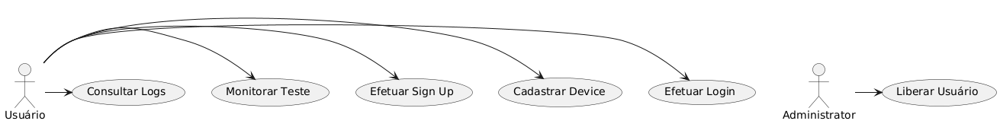

# Produto Mínimo Viável

As imagens acima são referente aos casos de uso inicial do sistema para que exista um produto mínimo viável. Como pode ser visto na figura acima há dois perfis de acesso: o usuário comum e o administrador do sistema. O administrador faz tudo o que o usuário faz e as funções administrativas. 

Por questões de segurança ainda não dá pra deixar que os usuários simplesmente se cadastrem e comecem a utilizar a plataforma. Isso porque toda a parte de segurança dela não foi testada e as coisas ainda estão em desenvolvimento. 

O fluxo normal é que o usuário faz o cadastro no sistema e depois de liberado ele tem o direito a cadastrar um device. Após cadastrar o device o usuário pode fazer um teste com o device no site recebendo informações. Além disso, o usuário pode consultar o registro de informações enviadas do dispositivo.

Este é o produto mínimo que considerei viável. 