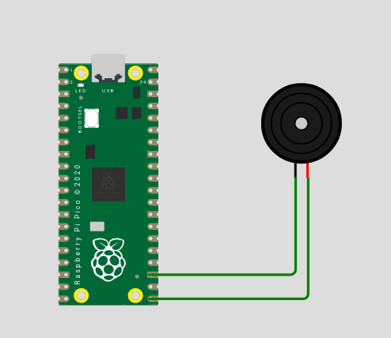

# Buzzer com Pi Pico

Este artigo descreve o interfaceamento de uma Pi Pico com um Buzzer Passivo de 5VDC. Este artigo é parte de uma série para testes de conceito do projeto da [Estação Meteorológica](https://tempodocs.projetosdesoftware.com.br). 

## Lista de Materiais

| Quantidade |   Descrição   |
| :--------: | :-----------: |
|     01     |  Pi Pico[^1]  |
|     01     |  ProtoBoard   |
|     01     | Buzzer - 5VDC |

## A Ideia

Estou montando o projeto da [Estação Meteorológica](https://tempodocs.projetosdesoftware.com.br) no grupo da [Mecatrônica Jovem](https://www.mecatronicajovem.com.br). Uma das ideias que tive era que o projeto tivesse uma interface auditiva para indicar erros e acertos. As Placas-Mãe antigas possuíam recursos auditivos para indicar problemas com memória, placa de vídeo, recursos não visuais. Dependendo da quantidade de Bips era um tipo de erro. Cada fabricante tinha o seu padrão. 

Uma das motivações é que o usuário não consegue saber se o dispositivo conectou ou não na rede. O fato de não ter nenhuma interface que indique isso (o console serial só funciona conectado) torna as coisas complicadas caso seja necessário uma depuração. 

Dito isso, fui pesquisar na internet um interfaceamento de uma raspberry pi pico com buzzer. A Pi Pico é uma placa que eu tenho aqui e que já estou mexendo na bancada com [Micropython](https://micropython.org/). Por sorte encontrei uma biblioteca que já possui uma série de presets para música com pi pico. Tudo isso com um excelente tutorial explicativo. Você pode conferir o [artigo original aqui](https://projects.raspberrypi.org/en/projects/introduction-to-the-pico/9).

## O Circuito



O circuito é aparentemente simples. Uma Pi Pico com o negativo do Buzzer ligado no Pino GND.5(pino 23) e o positivo do Buzzer no pino GPIO16(Pino 21). O próximo passo é dentro do software.

### Instalando a biblioteca PicoZero

Há alguns pré-requisitos: 

1. Você precisará utilizar o [Thonny](https://thonny.org/)
2. Você precisará ter instalado o MicroPython na sua Pi Pico. Escrevi um artigo sobre como fazer isso. 

O modo que eu achei mais fácil foi o seguinte: 

1. Entre no repositório da Biblioteca da Pi [PicoZero](https://github.com/RaspberryPiFoundation/picozero)
2. Acesse pela Web o diretório picozero
3. Abra o arquivo picozero.py 
4. Copie o conteúdo. Fica mais fácil se vc utilizar o modo raw no github. Para isso pressione o ícone raw que aparece na janela do arquivo. Ele abrirá uma nova janela com somente o texto do arquivo para copiar(ctrl+a para selecionar tudo, ctrl+c) e colar(ctrl+v).

Depois, entre no Thonny e faça o seguinte: 

1. Com o seu dispositivo conectado crie um novo arquivo chamado picozero.py direto na sua placa. A contrapartida é que dá pra criar arquivos na sua máquina ao invés de criar direto na placa. 
2. Cole o conteúdo do arquivo que foi copiado do github. 
3. Pronto. Você poderá utilizar as funções da biblioteca nos seus programas. 

Existe um outro passo que é instalar pelo Thonny. Nos testes que eu fiz não funcionou direito. 

### O Programa

Vamos fazer o primeiro teste. No programa abaixo ele deve tocar um bip, nota dó, durante 1 segundo.

```python

from picozero import Speaker
speaker = Speaker(16)
speaker.play('c4', 1)

```

O legal desta biblioteca, a picozero, é que ela tem mapeada a escala musical. Mas, vamos explicar o programa acima por partes: 

1. A Primeira linha é a importação do recurso Speaker(Autofalante) da biblioteca. 
2. A segunda linha atribui a variável speaker o recurso Speaker, da biblioteca, que será utilizado no GPIO16 (pino 21 da placa). Se fosse utilizado em outro GPIO seria o número deste GPIO. Você pode ligar o Buzzer em outros GPIOs desde que ao utilizar o recurso diga qual é o GPIO que está utilizando. 
3. A terceira linha toca a nota dó (no inglês é C), na quarta escala (isso é o que determina a frequência), durante um segundo, que é o segundo parâmetro da função. Na função então: **o primeiro argumento é a nota**, que é uma enumeração para frequência, e o **segundo argumento é a duração, que está em segundos**.

Agora vamos fazer um arranjo. Uma melodia, mesmo curta, é uma série de notas em sequência com duração variável. Mas antes vamos definir algumas convenções:

1. Vou utilizar uma semínima(nota musical) como um tempo. Não existe um tempo fixo definido em segundos para tocar uma música, mas existe algumas convenções dependendo do movimento. O pessoal costuma ajustar o metrônomo em X batidas por minuto de acordo com o movimento da peça. A convenção costuma girar entre X batidas e Y batidas por minuto. Para o nosso artigo consideraremos 88 batidas por minuto. Como o tempo está em segundos teremos que fazer a conversão. O resultado é 0,68 segundos por batida. Esse será definido como o nosso tempo. 

```python

from picozero import Speaker
speaker = Speaker
speaker = Speaker(16)

tempo = 0.68 # constante definida acima - 1 tempo = 0.68 segundos
melodia = [ ['e5', tempo],['e5', tempo],['f5', tempo], ['g5', tempo], ['g5', tempo], ['f5', tempo],['e5', tempo], ['d5', tempo], ['c5', tempo], ['c5', tempo],['d5', tempo], ['e5', tempo], ['e5', tempo*2], ['d5', tempo*2]]
speaker.play(melodia)

```

Na melodia acima temos o início da Ode a Alegria(que é uma das poucas músicas que eu decorei). Mas quando não tiver internet, por exemplo, podemos colocar um som de terror. Quando um teste for bem sucedido, uma melodia de sucesso, entre outras coisas. A ideia é explorar as possibilidades. 


## Links e Referências

1. Repositório da Biblioteca PicoZero
   1. https://github.com/RaspberryPiFoundation/picozero 
2. Artigo que explica a parte do Buzzer
   1. https://projects.raspberrypi.org/en/projects/introduction-to-the-pico/9
3. Documentação atualizada da biblioteca PicoZero
   1. https://picozero.readthedocs.io/en/latest/gettingstarted.html - 
4. Link da documentação da Estação Meteorológica
   1. https://tempodocs.projetosdesoftware.com.br 
5. Site da Estação Meteorológica (em construção)
   1. https://tempo.projetosdesofware.com.br

---

[^1]: Pode ser qualquer Pi Pico para esse teste de conceito. Estou utilizando a Pi Pico 2W. 